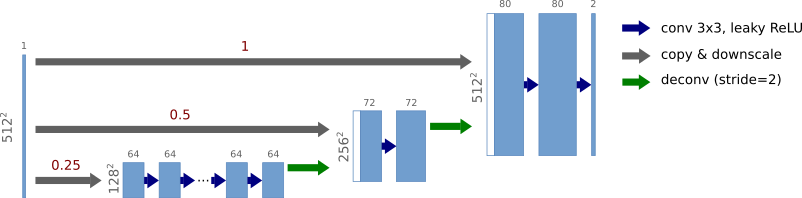
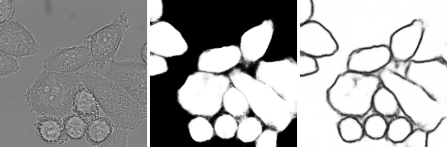

# J-Net: Multiresolution Neural Network for Semantic Segmentation
Multiresolution neural network for segmentic segmentation inspired by the U-net 
[1]. Since it consists of the expansive path only, it resembles the letter J 
(hence the name). The network is composed of several segments (one for each 
resolution level) such that the first one operates on the lowest resolution and 
the final one on the original image resolution. Each segment is a convolutional 
neural network (CNN) followed either by a deconvolution layer [2], which 
upsamples the output of the segment by factor two, or a final layer which 
outputs the segmentation. The input of the first segment is the image 
downsampled to the lowest resolution and the input of the other segments is the
(upsampled) output of the previous segment concatenated with the image 
downsampled to the corresponding resolution level.

The figure shows an example of a J-net architecture. It consists of three 
segments, each being a CNN with 3&times;3 convolution filters and leaky ReLU 
activations. In order to maintain the spatial dimensions of the input 
throughout the segment the convolutions are preceded with a padding layer, 
which extends the tensor by reflecting the boundary pixels. The convolutions 
are furthermore followed by the batch normalization. The lowest 
resolution segment (128&times;128 px) has 16 convolution layers with 64 channels, 
the following segment (256&times;256 px) has 2 layers with 72 channels and the 
final full resolution segment (512&times;512 px) has 
2 layers with 80 channels. The last layer has two output channels - one for 
binary segmentation (sigmoid activations) and the other predicts for each pixel
its (truncated) distance to the nearest cell boundary (ReLU activation). In 
total (including the deconvolution and final layers) the network has 23 layers.

## Dependencies
The code is known to work with

* Python 3.5, 3.6
* numpy 1.13, 1.14
* PyTorch 0.2.0, 0.3.1

Other versions may work too (and probably will) but they were not tested.

## Example
This example demonstrates the J-net on segmentation of images from the 
DIC-C2DH-HeLa from the Cell Tracking Challenge [3]. The structure of the 
network was the same as described above. Since there are only 17 annotated
images, data augmentation was used extensively when training the network
(random flips and elastic transforms). The truncation threshold for the 
boundary-distance was set to 6 pixels. The optimizer was Adam, the initial 
learning rate was 0.00003 (decreased my multiplicative factor 0.75 if the 
training loss did not decrease for 30 epochs) and the training was
stopped after 1850 epochs. The batch size was 8 and to make the size of the
training set was artificially increased by replicating each training image 16 
times (note that due to random augmentation the network never see the same 
image multiple times). The loss was sum of the BCE loss of the segmentation
output and the MSE loss of the boundary-distance layer.
The full command used to start the learning was as follows:

`python3 main.py --cuda --images_idx '{"01":["002","005","021","031","033","034","039","054"],"02":["006","007","014","027","034","038","042","061","067"]}' --load_dataset_to_ram 1 --num_workers -1 --dataset_len_multiplier 16 --batch_size 8 --resolution_levels "[-2,-1,0]" --aug_rotation_flip --aug_elastic_params "[(50,5,5),(-1,-1,1)]" --structure "[[16,64,3],[2,8,3],[2,8,3]]" --dt_bound ${DT_BOUND} --validation_percentage 0.17 --learning_rate 0.00003 --mode train --dataset_root "/path/to/DIC-C2DH-HeLa_training" --output_dir results/DIC-C2DH-HeLa6`

This command needs about 14 GB of GPU memory and one learning epoch takes about 
30 seconds. Most of the time is spent on elastic transforms since they have to 
be done on the original resolution.

Segmentation results for all images in the challenge sequences can be obtained by

`python3 main.py --cuda --resolution_levels '[-2,-1,0]' --dt_bound 6 --images_idx '{"01":[],"02":[]}' --mode vis --dataset_root /path/to/DIC-C2DH-HeLa_test --model_file results/DIC-C2DH-HeLa6/model_best_train_train --output_dir results/DIC-C2DH-HeLa6`

One image takes about 0.12 seconds. 

**Results**  

Segmentation results on a training image from the DIC-C2DH-HeLa dataset (image 038 from sequence 02, same as in the U-net paper).
From left to right: original image, segmentation, truncated distance to cell boundary. 
The upper row are the images generated by the network and the lower row is the ground truth:

 

Segmentation results on an image from a challenge sequence (image 024 from sequence 01, 
no image from the challenge sequence was used during the training). From left to right: 
original image, segmentation, truncated distance to cell boundary:

## Input arguments
Required arguments are typed in bold face.

**Main arguments**

* --batch_size\
Size of the batch. Default value is 1.

* --dataset_len_multiplier\
Determines how many times is every training image replicated. Image replication 
allows to use bigger batch size and makes the training more stable. Default 
value is 1 (no replication)

* --dt_bound\
Truncation threshold for the boundary-distance output. Default value is 9.

* **--dataset_root**\
Directory with the Cell Tracking Challenge dataset (it contains subdirectories 01, 02 and optionally 01_GT and 02_GT).

* **--images_idx**\
Dictionary of lists of three digit ids of the input images from the Cell Tracking 
Challenge. The keys of the dictionary are the sequence numbers (including the 
leading zero). For example `'{"01":["002","005","021"]'}` means images 002, 005 and 021
from sequence 01 and `'{"01":["002","005","021"],"02":["006","007"]}'` means images
002, 005 and 021 from sequence 01 and images 006 and 007 from sequence 02. The images 
ids must be specified explicitely in train and eval mode. In vis mode the list of ids
might be empty, e.g. '{"01":[]}', in which case the script takes all the images from
the sequence(s).

* --learning_rate\
Learning rate. Default value is 0.0001.

* --load_dataset_to_ram\
If 1, the script preloads training images to RAM instead of loading them from HDD 
on demand. This saves some time when the training set is small and the images are 
replicated. Default value is 0.

* --mode\
Mode of the script. Possible values are "train", "eval" and "vis". The train mode
is used for parameter learning, the eval mode is used for calculating the loss and 
accuracies for input images and the vis mode is used for visualization (similar to
eval mode, but does not need ground truth for the input images). Default value is 
"train".

* --model_file\
File name of the model loaded in the eval or vis mode. Default value is ''.

* --num_epochs\
Number of training epochs. Default value is 5000.

* **--output_dir**\
Output directory, where the script saves the learned models (train mode) and 
segmentation results (vis, eval). If the directory does not exist, the script 
tries to create it.

* **--resolution_levels**\
List of resolution levels. Every level is a negative integer (or 0), such
that the corresponding input is downscaled by factor 2-lvl. For 
example 0 is the original resolution, for -1 the image is downscaled by factor 2,
-2 is downscaled by factor 4 etc. The resolution levels must be consecutive 
numbers in ascending order. Last level can be smaller than zero (this is useful
mainly for debugging). For example "[-3,-2,-1]" means, that the input to the 
initial segment is downscaled by factor 8 and the output of the network is half
the size of the input images.

* --save_model_frequency\
Save model every save_model_frequency-th epoch. -1 means never. Default value is 200.

* **--structure**\
Structure of the network in the format 
"[[numof_layers1,numof_channels1,rf_size1],[numof_layers2,additional_numof_channels2,rf_size2],[numof_layers3,additional_numof_channels3,rf_size3],...]",
where numof_layers is the number of convolution layers, numof_channels is the number 
of channels and rf_size is the size of the convolution filters in pixels.
Number of channels is additive, i.e., number of channels in the second segment
is given by numof_channels1+additional_numof_channels2.

* --validation_percentage\
Percentage (number between 0 and 1) of the available training images used for 
validation during training. Default value is 0 (no validation is done).

**Data augmentation**
* --aug_elastic_params\
List of parameters for elastic transforms: [[alpha1, sigma1, weight1], [alpha2, sigma2, weight2],...], 
where alpha and sigma are parameters of the elastic transform and weight is the unnormalized probability of this 
combination. Parameter alpha is related to the scale of the transform and sigma to its smoothness 
(see [https://gist.github.com/chsasank/4d8f68caf01f041a6453e67fb30f8f5a](https://gist.github.com/chsasank/4d8f68caf01f041a6453e67fb30f8f5a)
for more details). For example [[50, 5, 7], [4, 1, 2]] means, that the image will be with probability
7/9 distorted with parameters alpha=50, sigma=5, and with probability 2/9 with parameters alpha=4, sigma=1.
If either alpha or sigma is smaller than 0, this parameter combination means no distortion is done.
This can be used to include the original non-distorted images into the training set.

* --aug_intensity_params\
List of parameters for intensity transform of the foreground pixels: "[shift_lbound, shift_ubound, mult_lbound, mult_ubound]".
The intensity _i_ of every foreground pixel is changed to _i_+(_m_*_i_)+_s_*foreground_mean, 
where _m_ is a random number from interval [mult_lbound, mult_ubound] and
_s_ is a random number from interval [shift_lbound, shift_ubound].
If mult_lbound>mult_ubound or shift_lbound>shift_ubound, the corresponding 
part of the intensity transform is not used.

* --aug_rotation\
Determines, whether to use random rotations. The images are rolled by random 
number of pixels along both axes, rotated and cropped to the original size.
Undefined pixels are interpolated as if the input image was padded by reflecting 
the boundary pixels. The advantage of this procedure is that pixels in the image 
corners are equally likely to be in the rotated image as the pixels that were 
originally close to its center. On the down side the rolling introduces artificial 
edges.

* --aug_rotation_flip\
Determines, whether to use random flips and 90° rotations.

**GPU related**

--cuda\
Use GPU if available.

--num_workers\
Number of workers used for loading and augmenting the training images. If -1, data augmentation 
is done on GPU (if available). Default value is 0 (PyTorch default).

**Other**

--batchnorm_momentum\
Momentum parameter for BatchNorm2d layers. Default value is 0.1 (PyTorch default).

--non_decreasing_output_file\
Output file for debugging early-stopping experiments. Default value is "" (no debugging).

# References
[1] Ronneberger, O., Fischer, P., Brox, T.: U-net: Convolutional networks for biomedical image segmentation. 
In Medical Image Computing and Computer-Assisted Intervention – MICCAI 2015. pp. 234–241. Springer International Publishing, Cham (2015). 
Available at [arXiv:1505.04597](https://arxiv.org/abs/1505.04597).

[2] Long J., Shelhamer E., Trevor Darrell T.: Fully convolutional networks for semantic segmentation.
In 2015 IEEE Conference on Computer Vision and Pattern Recognition (CVPR). pp. 3431-3440.
Available at [arXiv:1411.4038](https://arxiv.org/abs/1411.4038).

[3] [http://www.celltrackingchallenge.net](http://www.celltrackingchallenge.net)

